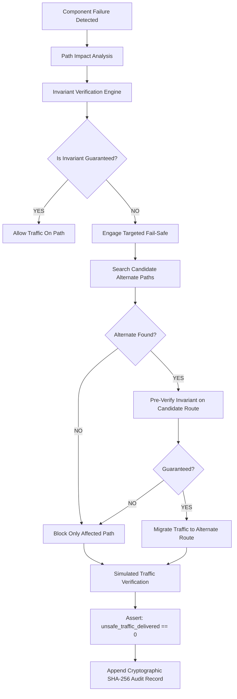

# InvariantHold: Technical Architecture Specification

## 1. Executive Summary

InvariantHold resolves the fundamental breakdown in distributed security enforcement: **relying on individual component health flags fails to guarantee security invariants along traffic paths.**

When an intermediate enforcement point degrades (e.g. Primary Encryption Gateway `ENC-01`), perimeter firewalls and servers remain green, masking the reality that sensitive payment records are transiting without encryption. Traditional security orchestration reacts either with neglect (security breach) or blind fail-closed shutdowns (costly collateral outage).

InvariantHold introduces **Path-Level Deterministic Invariant Verification**:
- **Source of Truth**: The deterministic invariant engine mathematically proves if all required controls for an invariant are present and operational on a path.
- **Targeted Fail-Safe**: Isolates *only* the affected unsafe paths, preserving 100% of unrelated traffic flows.
- **Safe Rerouting**: Discovers alternate paths and strictly verifies that the invariant is `GUARANTEED` before any traffic is migrated.
- **Measurable Safety Property**: `unsafe_traffic_delivered == 0` across all operating conditions.
- **Advisory AI & ML**: scikit-learn Isolation Forest detects abnormal telemetry shifts without ever overriding deterministic security proofs.

---

## 2. Component Pipeline

---

## 3. Technology Stack & Separation of Concerns

| Tier | Technology | Role | Final Security Authority? |
|---|---|---|:---:|
| **Invariant Verification** | Python / NetworkX | Path-level control reachability & health evaluation | **YES (Source of Truth)** |
| **Targeted Fail-Safe** | FailureEngine | Precision path isolation without collateral damage | **YES** |
| **Safe Rerouting** | ReroutingEngine | Graph alternate discovery & pre-verified migration | **YES** |
| **Traffic Simulation** | TrafficEngine | Ground-truth packet simulation across paths | Evaluates Ground Truth |
| **ML Anomaly Detection**| scikit-learn IsolationForest | Telemetry anomaly scoring & pattern recognition | **NO (Advisory Signal Only)** |
| **Risk Scoring** | RiskEngine | Normalized 0-100 composite risk calculation | **NO** |
| **Explainability** | ExplainEngine | Human-readable root cause & remediation advice | **NO** |
| **Audit Ledger** | SHA-256 Chaining | Immutable blockchain-style tamper-evident log | Verification Ledger |
| **Backend API** | FastAPI / SQLite WAL | High-performance REST endpoints | API Layer |
| **Frontend SOC** | Dark Cyber UI / React Flow | Real-time interactive telemetry visualization | Presentation |
