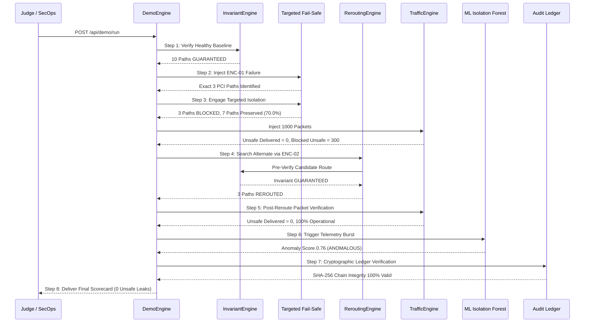

# Judge Demonstration Script & Verification Walkthrough

## 1. Automated 8-Step Verification Workflow

The One-Click Judge Demo executes this automated 8-step lifecycle:

---

## 2. Expected Scorecard Assertions

1. **Security Invariants Guaranteed**: `YES`
2. **Unsafe Traffic Delivered**: `0`
3. **Unnecessary Paths Blocked**: `0` (Zero collateral damage)
4. **Safe Path Preservation**: `70.0%` dynamically calculated during failure
5. **Recovery Time**: Sub-second deterministic isolation & rerouting
6. **Audit Integrity**: `VERIFIED`
